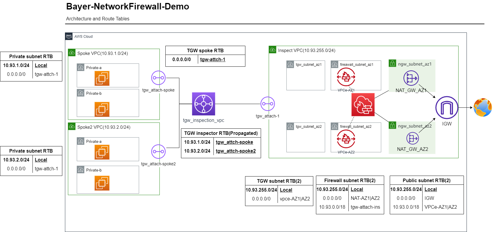

# AWS Network Firewall Demo

This demo environment showcases a centralized network inspection architecture using AWS Network Firewall, Transit Gateway, and multiple VPCs.

## Architecture Overview



The demo environment consists of:
- 2 Spoke VPCs
- 1 Inspection VPC
- EC2 instances in each Spoke VPC
- Transit Gateway (TGW) for inter-VPC routing
- AWS Network Firewall for centralized traffic inspection

## Components

1. **Spoke VPCs**: Two VPCs simulating application environments.
2. **Inspection VPC**: A centralized VPC hosting the AWS Network Firewall.
3. **EC2 Instances**: Deployed in each Spoke VPC for testing connectivity.
4. **Transit Gateway (TGW)**: Facilitates routing between Spoke VPCs and the Inspection VPC.
5. **AWS Network Firewall**: Provides centralized network security for all traffic.

## Deployment Steps

1. Clone this repository to your local machine.

2. Initialize Terraform:
   ```
   terraform init
   ```

3. Review and modify variables if needed in `variables.tf`. The default region is set to Ningxia (cn-northwest-1).

4. Deploy the infrastructure:
   ```
   terraform apply
   ```

5. Review the changes and type `yes` to proceed with the deployment.

## Verification Steps

After deployment, you can verify the setup using AWS Systems Manager Session Manager:

1. Go to the EC2 console and select one of the EC2 instances in a Spoke VPC.

2. Click on "Connect" and choose the "Session Manager" tab.

3. Click "Connect" to start a session.

4. Once connected, you can test the Network Firewall rules:
   - Ping test: `ping www.baidu.com` (should work due to the ICMP allow rule)
   - Curl test: `curl www.baidu.com` (should be blocked by the firewall rule)

## Notes

- The default region for this demo is Ningxia (cn-northwest-1). If you need to use a Beijing region, update  `variables.tf` 'aws_region' to cn-north-1.
- The Network Firewall is configured to allow ICMP traffic but block access to www.baidu.com as an example rule.
- All inter-VPC traffic is routed through the Transit Gateway and inspected by the Network Firewall in the Inspection VPC.

## Cleanup

To avoid incurring unnecessary costs, remember to destroy the resources when you're done:

```
terraform destroy
```

Review the resources to be destroyed and type `yes` to confirm.
