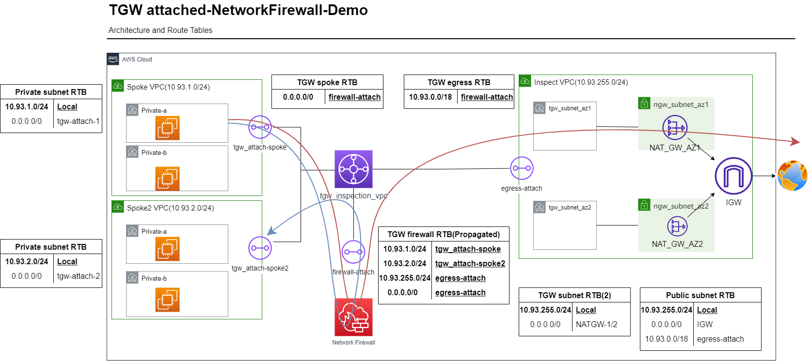

# AWS TGW-Attached Network Firewall Demo

This demo environment showcases a **TGW-attached Network Firewall** architecture for centralized network inspection using AWS Network Firewall directly attached to Transit Gateway.

## Architecture Overview



The demo environment implements a **TGW-attached Network Firewall** architecture consisting of:
- 2 Spoke VPCs with EC2 instances
- 1 Egress VPC with NAT Gateways for internet access
- Transit Gateway (TGW) with TGW-attached Network Firewall
- AWS Network Firewall directly attached to TGW (not in a VPC)

## Key Architecture Benefits

**TGW-Attached vs VPC-Attached Network Firewall:**
- ✅ **Simplified Routing**: Eliminates complex VPC endpoint routing tables across multiple AZs
- ✅ **AZ-Agnostic Design**: No need for per-AZ route table management
- ✅ **Easy Migration**: Perfect for existing centralized NAT Gateway architectures
- ✅ **Reduced Latency**: Direct TGW attachment eliminates extra hops through inspection VPC
- ✅ **Better Scalability**: No VPC limits on firewall capacity
- ✅ **Simplified Management**: Centralized firewall management at TGW level without VPC dependencies

## Components

1. **Spoke VPCs**: Two VPCs (10.10.1.0/24, 10.10.2.0/24) with EC2 instances for testing
2. **Egress VPC**: Centralized internet egress (10.10.255.0/24) with NAT Gateways
3. **EC2 Instances**: Deployed in each Spoke VPC with SSM connectivity
4. **Transit Gateway**: Central routing hub with TGW-attached Network Firewall
5. **Network Firewall**: Directly attached to TGW for all traffic inspection

## Traffic Flow

**Inter-VPC Communication:**
1. Spoke VPC 1 → TGW (spoke route table) → Network Firewall → TGW (firewall route table) → Spoke VPC 2

**Internet Access:**
1. Spoke VPC → TGW (spoke route table) → Network Firewall → TGW (firewall route table) → Egress VPC → NAT Gateway → Internet

**Return Traffic:**
1. Internet → NAT Gateway → Egress VPC → TGW (egress route table) → Network Firewall → TGW (firewall route table) → Spoke VPC

## Deployment Steps

### Prerequisites
- AWS CLI configured with appropriate permissions
- Terraform >= 1.0 installed
- Access to AWS China regions (cn-northwest-1 or cn-north-1)

### Deploy Infrastructure

1. **Clone and Initialize**:
   ```bash
   git clone <repository-url>
   cd aws-network-firewall-demo
   terraform init
   ```

2. **Review Configuration**:
   - Default region: `cn-northwest-1` (Ningxia)
   - Modify `variables.tf` if needed for different region or CIDR blocks

3. **Deploy Infrastructure**:
   ```bash
   terraform plan
   terraform apply
   ```

4. **Verify Deployment**:
   ```bash
   terraform output
   ```

## Testing and Verification

### Automated Testing

Run the comprehensive connectivity test:
```bash
./connectivity_test.sh
```

This script tests:
- ✅ SSM connectivity to all EC2 instances
- ✅ Inter-VPC communication through firewall
- ✅ Internet connectivity (ICMP to cn.bing.com)
- ✅ ICMP to blocked domain (ping www.baidu.com - ICMP rule allows all ICMP)
- ✅ HTTP access to allowed domains (cn.bing.com)
- ✅ AWS Console access (cn-northwest-1.console.amazonaws.cn)
- ❌ HTTP blocking of restricted domains (www.baidu.com)

### Manual Testing via Session Manager

1. **Access EC2 Instance**:
   - Go to EC2 Console → Select instance → Connect → Session Manager

2. **Test Inter-VPC Connectivity**:
   ```bash
   # From Spoke VPC 1 to Spoke VPC 2 (use actual private IP from EC2 console)
   ping <spoke-vpc-2-instance-private-ip>
   ```

3. **Test Internet Access**:
   ```bash
   # ICMP to allowed domain (should work)
   ping cn.bing.com
   
   # ICMP to blocked domain (should work - ICMP rule allows all ICMP traffic)
   ping www.baidu.com
   
   # HTTP to allowed domain (should work)
   curl http://cn.bing.com
   
   # HTTPS to AWS Console (should work)
   curl https://cn-northwest-1.console.amazonaws.cn
   
   # HTTP to blocked domain (should fail - URL blocking rule)
   curl http://www.baidu.com
   ```

## Network Firewall Security Policies

### Implemented Rules

1. **ICMP Allow Rule** (Priority 200):
   - Permits ICMP traffic for connectivity testing
   - Allows ping between VPCs and to internet

2. **URL Blocking Rule** (Priority 100):
   - Blocks HTTP/HTTPS access to www.baidu.com
   - Demonstrates domain-based filtering

3. **AWS Managed Rules**:
   - **MalwareDomainsStrictOrder** (Priority 50): Blocks known malware domains
   - **ThreatSignaturesBotnetStrictOrder** (Priority 75): Blocks botnet signatures

4. **Default Action**: `aws:alert_established` - Allows established connections with alerting

### Rule Processing Order
Rules are processed in strict order by priority (lower number = higher priority):
1. Priority 50: Malware domains (DENY)
2. Priority 75: Botnet signatures (DENY) 
3. Priority 100: URL blocking (DENY www.baidu.com)
4. Priority 200: ICMP allow (PASS)
5. Default: Alert established connections

## TGW Configuration Options

### Current Configuration: Manual Control

The Terraform configuration uses **manual route table associations and propagations** for predictable behavior:

- ✅ **Predictable**: Explicit control over each attachment
- ✅ **Spoke VPCs**: Explicitly associated with spoke route table
- ✅ **Firewall**: Explicitly associated with firewall route table  
- ✅ **Egress VPC**: Explicitly associated with egress route table
- ✅ **Propagations**: All route propagations explicitly configured

### Alternative: Automatic Default Route Tables

For easier management of new spoke VPCs, you can optionally enable automatic default route tables:

#### Steps to Enable Automatic Mode:

**Modify TGW Settings** (via AWS Console or CLI):
   - Go to TGW console, select TGW, click Action - > Modify transit gateway
   - Enable Default route table association, choose <spoke-route-table>
   - Enable Default route table propagation, choose <firewall-route-table>


#### Trade-offs:

**Manual Control (Current)**:
- ✅ Predictable and explicit configuration
- ✅ Full control over each attachment
- ❌ Requires explicit configuration for each new spoke VPC

**Automatic Mode**:
- ✅ New spoke VPCs automatically configured
- ✅ Simplified management
- ❌ Less explicit control
- ❌ Potential for unexpected behavior during transitions


**Route Table Structure:**
- **Spoke Route Table**: Default association for spoke VPCs → routes all traffic to firewall
- **Firewall Route Table**: Firewall attachment → learns spoke routes via propagation → routes internet to egress
- **Egress Route Table**: Egress VPC → routes spoke traffic back to firewall


## Important Notes

- **Region**: Default region is `cn-northwest-1` (Ningxia). For Beijing region, update `aws_region` in `variables.tf` to `cn-north-1`
- **Architecture**: This implements **TGW-attached** Network Firewall, not VPC-attached
- **Traffic Flow**: All inter-VPC and internet traffic is inspected by the TGW-attached Network Firewall
- **Testing**: Use the provided `connectivity_test.sh` script for comprehensive validation
- **Migration**: This architecture is ideal for migrating from existing centralized NAT Gateway setups

## Troubleshooting

### Common Issues

1. **VPC Connectivity Issues**:
   - Check TGW route table associations
   - Verify firewall attachment status
   - Ensure security groups allow traffic

2. **Internet Access Problems**:
   - Verify NAT Gateway status in egress VPC
   - Check egress VPC route tables
   - Confirm firewall rules allow traffic

3. **Firewall Rules Not Working**:
   - Check firewall policy attachment
   - Verify rule group priorities
   - Review firewall logs in CloudWatch

### Useful Commands

```bash
# Check TGW route tables
aws ec2 describe-transit-gateway-route-tables

# Check firewall status
aws network-firewall describe-firewall --firewall-name tgw-attached-firewall

# View firewall logs
aws logs describe-log-groups --log-group-name-prefix /aws/networkfirewall
```

## Cleanup

To avoid incurring costs, destroy the resources when done:

```bash
terraform destroy
```

Review the resources to be destroyed and type `yes` to confirm.

